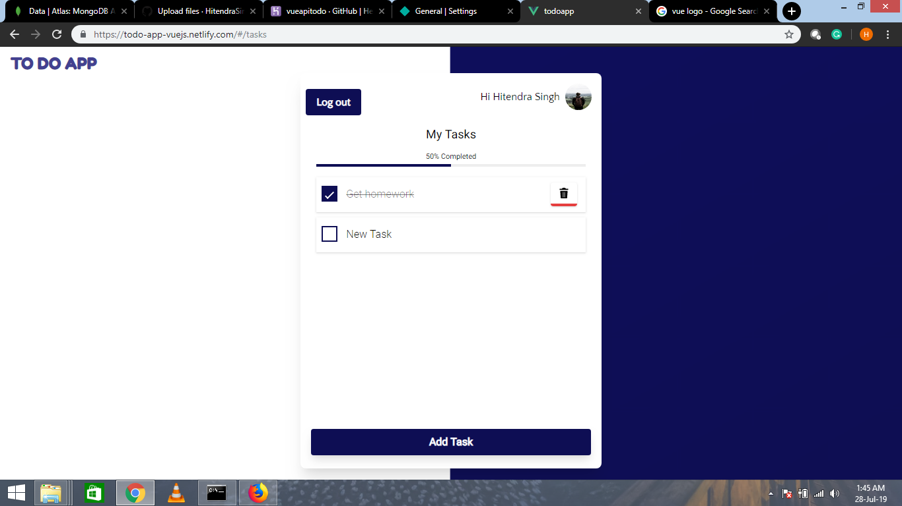

# todoapp

See [Live Demo](https://todo-app-vuejs.netlify.com/)

## Screenshots:

### Login


### Sign up


### Home


### Add Task


### Task Progress



## Project setup
```
npm install
```

### Compiles and hot-reloads for development
```
npm run serve
```

### Compiles and minifies for production
```
npm run build
```

### Run your tests
```
npm run test
```

### Lints and fixes files
```
npm run lint
```

### Customize configuration
See [Configuration Reference](https://cli.vuejs.org/config/).
